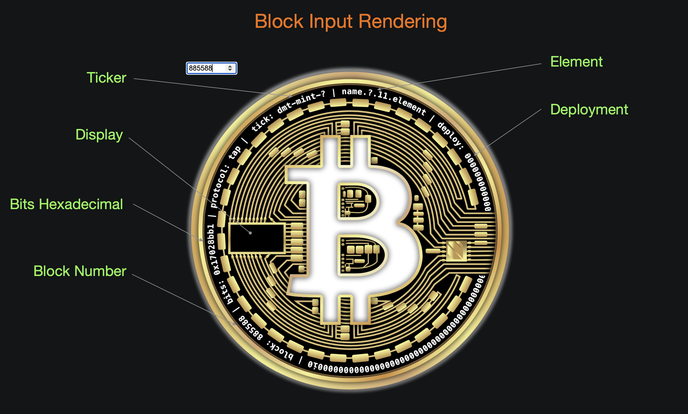
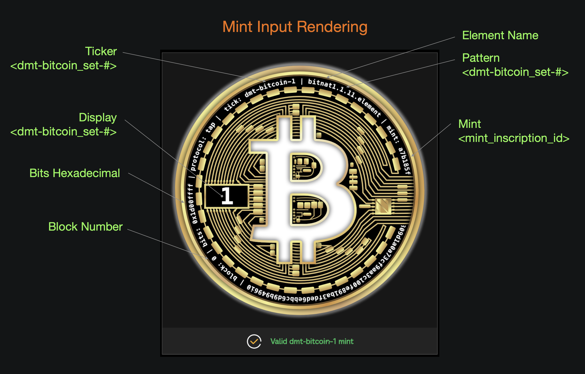

# BASICS

👉 **DMT-₿ITCOINS** ... are ...
- generated by mining ₿itcoin blocks    
- [ordinal inscriptions](https://docs.ordinals.com/) on the ₿itcoin network and stored within ₿itcoin transactions  
- on-chain claims to ₿itcoin block data using the [tap protocol](https://github.com/Trac-Systems/tap-protocol-specs)  
- indexed by the decentralized [trac network](https://trac.network)  
- Unique Non-Arbitrary Tokens (UNATs) forged from Digital Matter Theory [DMT](https://digital-matter-theory.gitbook.io/digital-matter-theory)  
- based on bit patterns (0's & 1's) found in the bits hexadecimal of mined ₿itcoin blocks   
- grouped into twelve (12) sets according to the bits hexadecimal pattern     
- available to mint on [mscribe.io](https://mscribe.io/nats?t=latest) in twelve (12) blockpads  
- trading incredibly fast on Trac Networks's HyperMall ... soon!  

# TOKENOMICS

  

The DMT-₿ITCOIN [dashboard](https://dune.com/bitgnat/dmt-bitcoin) is updated daily at 12:00 UTC and provides the following stats:  

📙**Spectrum**:  
➤ rarity classifications for the twelve (12) DMT-₿ITCOIN sets
  
📙**Supply**:  
➤ dynamic supply of each DMT-₿ITCOIN, which may or may not generate based on mined ₿itcoin block data
  
📙**Collection**:  
➤ expansionary total supply of the collection of DMT-₿ITCOIN sets
  
📙**Rarity**:  
➤ DMT-₿ITCOIN rarity as a percent of the collection total supply
  
📙**Expansion**:  
➤ percentage of blocks that generate a DMT-₿ITCOIN
  
📙**Growth Rate**:  
➤ overall rate of production for the DMT-₿ITCOIN collection

  

# DMT-MINTS

There are twelve (12) sets of DMT-₿ITCOIN available to mint on [mscribe.io/nats](https://mscribe.io/nats?t=latest)  

[Blockpad links](https://mscribe.io/nats?t=latest) and the (maximum number of mints per wallet):  

🟧 [dmt-bitcoin-0](https://mscribe.io/nats/dmt-bitcoin-0) (500)  

🟧 [dmt-bitcoin-00](https://mscribe.io/nats/dmt-bitcoin-00) (50)  

🟧 [dmt-bitcoin-01](https://mscribe.io/nats/dmt-bitcoin-01) (50)  

🟧 [dmt-bitcoin-1](https://mscribe.io/nats/dmt-bitcoin-1) (500)  

🟧 [dmt-bitcoin-10](https://mscribe.io/nats/dmt-bitcoin-10) (25)  

🟧 [dmt-bitcoin-11](https://mscribe.io/nats/dmt-bitcoin-11) (25)  

🟧 [dmt-bitcoin-010](https://mscribe.io/nats/dmt-bitcoin-010) (4)  

🟧 [dmt-bitcoin-011](https://mscribe.io/nats/dmt-bitcoin-011) (4)  

🟧 [dmt-bitcoin-100](https://mscribe.io/nats/dmt-bitcoin-100) (4)  

🟧 [dmt-bitcoin-101](https://mscribe.io/nats/dmt-bitcoin-101) (2)  

🟧 [dmt-bitcoin-110](https://mscribe.io/nats/dmt-bitcoin-110) (2)  

🟧 [dmt-bitcoin-111](https://mscribe.io/nats/dmt-bitcoin-111) (2)  

# LICENSE

### DMT-Bitcoin ordinals

**dmt-bitcoins** are on-chain inscriptions combining art, code, and Bitcoin-native permanence.  

### Live Inscription

View the live ordinal on [Ordinals Explorer](https://ordinals.com/inscription/1561a28f052b0c854d38560f92b98e1d78bfa91bf6bb553b7e8ba1a42dd9e0cfi0)  

> This repository contains a link to the original **dmt-bitcoin ordinal**, permanently inscribed on the Bitcoin blockchain. It serves as the **canonical on-chain software and generative template** for the entire collection of **dmt-bitcoins** (e.g., dmt-bitcoin-1, dmt-bitcoin-2, etc.).

> The contents of this repository and the on-chain ordinal are intended **only for personal use** and **non-commercial display of the dmt-bitcoin collections generated from the original tokens**.  
Derivative collections or recreations based on the source code or generative structure are **strictly prohibited**.

✅ **Permitted**:
- Viewing and interacting with the inscription as stored on Bitcoin.
- Resale or listing of the dmt-bitcoins generated from the **original token** on digital asset marketplaces.

❌ **Prohibited**:
- Commercial use, copying, or reproduction of any portion of this code.
- Modifications, derivative works, or extraction of HTML, JavaScript, or media assets.
- Creation of derivative inscriptions or collections using this software as a base.

See the full [LICENSE](./LICENSE) for details.  

### Images

> The images in this repository are licensed under the **Creative Commons Attribution-NonCommercial-NoDerivatives 4.0 International (CC BY-NC-ND 4.0)** license.

You are free to:

- **Share** — copy and redistribute the material in any medium or format

**Under the following terms**:

- **Attribution** — You must give appropriate credit, provide a link to the license, and indicate if changes were made.  
- **NonCommercial** — You may not use the material for commercial purposes.  
- **NoDerivatives** — If you remix, transform, or build upon the material, you may not distribute the modified material.

🔗 [View full license](https://creativecommons.org/licenses/by-nc-nd/4.0/)  

### Contact

For licensing inquiries or collaborations, reach out via:

- 📧 Email: [miners.founts_0c@icloud.com](mailto:miners.founts_0c@icloud.com)  
- 𝕏 Social: [@bitnat_sats](https://x.com/bitnat_sats)  

### Copyright

© 2025 **BitGnat**. All rights reserved.  
Use of this software outside of the original on-chain context, and use of the images for any purpose outside of the terms of the image license, is strictly prohibited without written permission.  

# ON-CHAIN ART

All DMT-₿ITCOIN in each of the twelve sets are rendered with one ordinal inscription code script:    

⦿ [inscription/1561a28f052b0c854d38560f92b98e1d78bfa91bf6bb553b7e8ba1a42dd9e0cfi0](https://ordinals.com/inscription/1561a28f052b0c854d38560f92b98e1d78bfa91bf6bb553b7e8ba1a42dd9e0cfi0)  

Therefore, each DMT-₿ITCOIN mint is:  
- **100% code** (all dmt-bitcoin mints are dynamically generated) &  
- **100% on-chain** (all dmt-bitcoin mints are embedded in Bitcoin transactions) 

### Rendering with Block Input  

➠ Generic image when only block numbers are provided:  

- Display: `blank`
- Ticker: `tick: dmt-mint-?`
- Element: `name.?.11.element`
- Deployment: `deploy: 0000000000000000000000000000000000000000000000000000000000000000i0`
- Block Number: `block: <blockNumber>`
- Bits Hexadecimal: `0x<bitsHex>`

  

### Rendering with Mint Input  

➠ Unique image when mint inscription id's are provided:  

- Display: `<dmt-bitcoin_set-#>`
- Ticker: `tick: dmt-bitcoin-<dmt-bitcoin_set-#>`
- Element: `name.<dmt-bitcoin_set-#>.11.element`
- Mint: `mint: <mint_inscription_id>`
- Block Number: `block: <blockNumber>`
- Bits Hexadecimal: `0x<blockNumber_bitsHex>`

  

# OFF-CHAIN ART   

collection static image:  

  

## dmt-bitcoin-0  

₿itcoin block bits hexadecimal pattern: `0`  
DMT element: `bitnats.0.11.element`  
rarity spectrum: `abundant`  

set scrolling gif:  

  

set static image:  

  

## dmt-bitcoin-00  

₿itcoin block bits hexadecimal pattern : `00`  
DMT element: `bitnat00.00.11.element`  
rarity spectrum: `popular`  

set scrolling gif:  

  

set static image:  

  

## dmt-bitcoin-01  

₿itcoin block bits hexadecimal pattern : `01`  
DMT element: `matter.01.11.element`  
rarity spectrum: `infrequent`  

set scrolling gif:  

  

set static image:  

  

## dmt-bitcoin-1  

₿itcoin block bits hexadecimal pattern : `1`  
DMT element: `bitnat1.1.11.element`  
rarity spectrum: `common`  

set scrolling gif:  

  

set static image:  

  

## dmt-bitcoin-10  

₿itcoin block bits hexadecimal pattern : `10`  
DMT element: `bitnat10.10.11.element`  
rarity spectrum: `scarce`  

set scrolling gif:  

  

set static image:  

  

## dmt-bitcoin-11  

₿itcoin block bits hexadecimal pattern : `11`  
DMT element: `Eleven.11.11.element`  
rarity spectrum: `scarce`  

set scrolling gif:  

  

set static image:  

  

## dmt-bitcoin-010  

₿itcoin block bits hexadecimal pattern : `010`  
DMT element: `ᘛ⁐̤ᕐᐷ.010.11.element`  
rarity spectrum: `limited`  

set scrolling gif:  

  

set static image:  

  

## dmt-bitcoin-011  

₿itcoin block bits hexadecimal pattern : `011`  
DMT element: `bitnat011.011.11.element`  
rarity spectrum: `limited`  

set scrolling gif:  

  

set static image:  

  

## dmt-bitcoin-100  

₿itcoin block bits hexadecimal pattern : `100`  
DMT element: `100.100.11.element`  
rarity spectrum: `limited`  

set scrolling gif:  

  

set static image:  

  

## dmt-bitcoin-101  

₿itcoin block bits hexadecimal pattern : `101`  
DMT element: `lol.101.11.element`  
rarity spectrum: `rare`  

set scrolling gif:  

  

set static image:  

  

## dmt-bitcoin-110  

₿itcoin block bits hexadecimal pattern : `110`  
DMT element: `bitnat110.110.11.element`  
rarity spectrum: `rare`  

set scrolling gif:  

  

set static image:  

  

## dmt-bitcoin-111  

₿itcoin block bits hexadecimal pattern : `111`  
DMT element: `genesis.111.11.element`  
rarity spectrum: `rare`  

set scrolling gif:  

  

set static image:  

  
