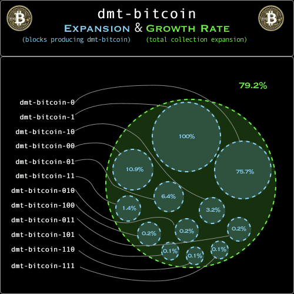

## basics

👉 **dmt-bitcoins** ... are ...  

&nbsp;&nbsp;&nbsp;&nbsp;&nbsp;&nbsp;&nbsp;- generated by mining ₿itcoin blocks  

👉 **dmt-bitcoins** ... are ...  

&nbsp;&nbsp;&nbsp;&nbsp;&nbsp;&nbsp;&nbsp;- [ordinal inscriptions](https://docs.ordinals.com/) on ₿itcoin  

👉 **dmt-bitcoins** ... are ...  

&nbsp;&nbsp;&nbsp;&nbsp;&nbsp;&nbsp;&nbsp;- on-chain claims to ₿itcoin block data using the [tap protocol](https://github.com/Trac-Systems/tap-protocol-specs)  

👉 **dmt-bitcoins** ... are ...  

&nbsp;&nbsp;&nbsp;&nbsp;&nbsp;&nbsp;&nbsp;- indexed by the [trac network](https://trac.network)  

👉 **dmt-bitcoins** ... are ...  

&nbsp;&nbsp;&nbsp;&nbsp;&nbsp;&nbsp;&nbsp;- Unique Non-Arbitrary Tokens (UNATs) forged from Digital Matter Theory [DMT](https://digital-matter-theory.gitbook.io/digital-matter-theory)  

👉 **dmt-bitcoins** ... are ...  

&nbsp;&nbsp;&nbsp;&nbsp;&nbsp;&nbsp;&nbsp;- based on bit patterns (0's & 1's) found in the bits hexadecimal of mined ₿itcoin blocks   

👉 **dmt-bitcoins** ... are ...  

&nbsp;&nbsp;&nbsp;&nbsp;&nbsp;&nbsp;&nbsp;- an aggregation of twelve (12) DMT UNAT sets  

👉 **dmt-bitcoins** ... are ...  

&nbsp;&nbsp;&nbsp;&nbsp;&nbsp;&nbsp;&nbsp;- available to mint on [mscribe.io](https://mscribe.io/nats?t=latest)  

👉 **dmt-bitcoins** ... are ...  

&nbsp;&nbsp;&nbsp;&nbsp;&nbsp;&nbsp;&nbsp;- trading incredibly fast on Trac's HyperMall ... soon!  

## stats

  

The DMT-₿ITCOIN dashboard is updated daily at 12:00 UTC and provides the following stats:  

📙 Spectrum:  
rarity classifications for the twelve (12) DMT-₿ITCOINS  

📙 Supply:  
dynamic supply of each DMT-₿ITCOIN, which may or may not generate based on mined ₿itcoin block data  

📙 Collection:  
expansionary total supply of the collection of DMT-₿ITCOIN sets  

📙 Rarity:  
DMT-₿ITCOIN rarity as a percent of the collection total supply  

📙 Expansion:  
percentage of blocks that generate a DMT-₿ITCOIN  

📙 Growth Rate:  
overall rate of production for the DMT-₿ITCOIN collection    

  

## on-chain art

There is one script that renders all dmt-bitcoins. 

⦿ [inscription/1561a28f052b0c854d38560f92b98e1d78bfa91bf6bb553b7e8ba1a42dd9e0cfi0](https://ordinals.com/inscription/1561a28f052b0c854d38560f92b98e1d78bfa91bf6bb553b7e8ba1a42dd9e0cfi0)  

**Rendering with Block Input**: 

- Display: `blank`
- Ticker: `tick: dmt-mint-?`
- Element: `name.?.11.element`
- Deployment: `deploy: 0000000000000000000000000000000000000000000000000000000000000000i0`
- Block Number: `block: <blockNumber>`
- Bits Hexadecimal: `0x<bitsHex>`

**Rendering with Mint Input**: 
- Display: `<dmt-bitcoin set #>`
- Ticker: `tick: dmt-bitcoin-<dmt-bitcoin set #>`
- Element: `name.<dmt-bitcoin set #>.11.element`
- Mint: `mint: <mint_inscription_id>`
- Block Number: `block: <blockNumber>`
- Bits Hexadecimal: `0x<blockNumber bitsHex>`

## dmt-mints

There are twelve (12) sets of DMT-₿ITCOIN available to mint at: [mscribe.io/nats](https://mscribe.io/nats?t=latest)

🟠 [dmt-bitcoin-0](https://mscribe.io/nats/dmt-bitcoin-0)  

🟠 [dmt-bitcoin-00](https://mscribe.io/nats/dmt-bitcoin-00)  

🟠 [dmt-bitcoin-01](https://mscribe.io/nats/dmt-bitcoin-01)  

🟠 [dmt-bitcoin-1](https://mscribe.io/nats/dmt-bitcoin-1)  

🟠 [dmt-bitcoin-10](https://mscribe.io/nats/dmt-bitcoin-10)  

🟠 [dmt-bitcoin-11](https://mscribe.io/nats/dmt-bitcoin-11)  

🟠 [dmt-bitcoin-010](https://mscribe.io/nats/dmt-bitcoin-010)  

🟠 [dmt-bitcoin-011](https://mscribe.io/nats/dmt-bitcoin-011)  

🟠 [dmt-bitcoin-100](https://mscribe.io/nats/dmt-bitcoin-100)  

🟠 [dmt-bitcoin-101](https://mscribe.io/nats/dmt-bitcoin-101)  

🟠 [dmt-bitcoin-110](https://mscribe.io/nats/dmt-bitcoin-110)  

🟠 [dmt-bitcoin-111](https://mscribe.io/nats/dmt-bitcoin-111)  

## dmt-bitcoin art  

collection static image:  

  

## dmt-bitcoin-0  

₿itcoin block bits hexadecimal pattern: `0`  
DMT element: `bitnats.0.11.element`  
rarity spectrum: `abundant`  

set scrolling gif:  

  

set static image:  

  

## dmt-bitcoin-00  

₿itcoin block bits hexadecimal pattern : `00`  
DMT element: `bitnat00.00.11.element`  
rarity spectrum: `popular`  

set scrolling gif:  

  

set static image:  

  

## dmt-bitcoin-01  

₿itcoin block bits hexadecimal pattern : `01`  
DMT element: `matter.01.11.element`  
rarity spectrum: `infrequent`  

set scrolling gif:  

  

set static image:  

  

## dmt-bitcoin-1  

₿itcoin block bits hexadecimal pattern : `1`  
DMT element: `bitnat1.1.11.element`  
rarity spectrum: `common`  

set scrolling gif:  

  

set static image:  

  

## dmt-bitcoin-10  

₿itcoin block bits hexadecimal pattern : `10`  
DMT element: `bitnat10.10.11.element`  
rarity spectrum: `scarce`  

set scrolling gif:  

  

set static image:  

  

## dmt-bitcoin-11  

₿itcoin block bits hexadecimal pattern : `11`  
DMT element: `Eleven.11.11.element`  
rarity spectrum: `scarce`  

set scrolling gif:  

  

set static image:  

  

## dmt-bitcoin-010  

₿itcoin block bits hexadecimal pattern : `010`  
DMT element: `ᘛ⁐̤ᕐᐷ.010.11.element`  
rarity spectrum: `limited`  

set scrolling gif:  

  

set static image:  

  

## dmt-bitcoin-011  

₿itcoin block bits hexadecimal pattern : `011`  
DMT element: `bitnat011.011.11.element`  
rarity spectrum: `limited`  

set scrolling gif:  

  

set static image:  

  

## dmt-bitcoin-100  

₿itcoin block bits hexadecimal pattern : `100`  
DMT element: `100.100.11.element`  
rarity spectrum: `limited`  

set scrolling gif:  

  

set static image:  

  

## dmt-bitcoin-101  

₿itcoin block bits hexadecimal pattern : `101`  
DMT element: `lol.101.11.element`  
rarity spectrum: `rare`  

set scrolling gif:  

  

set static image:  

  

## dmt-bitcoin-110  

₿itcoin block bits hexadecimal pattern : `110`  
DMT element: `bitnat110.110.11.element`  
rarity spectrum: `rare`  

set scrolling gif:  

  

set static image:  

  

## dmt-bitcoin-111  

₿itcoin block bits hexadecimal pattern : `111`  
DMT element: `genesis.111.11.element`  
rarity spectrum: `rare`  

set scrolling gif:  

  

set static image:  

  
